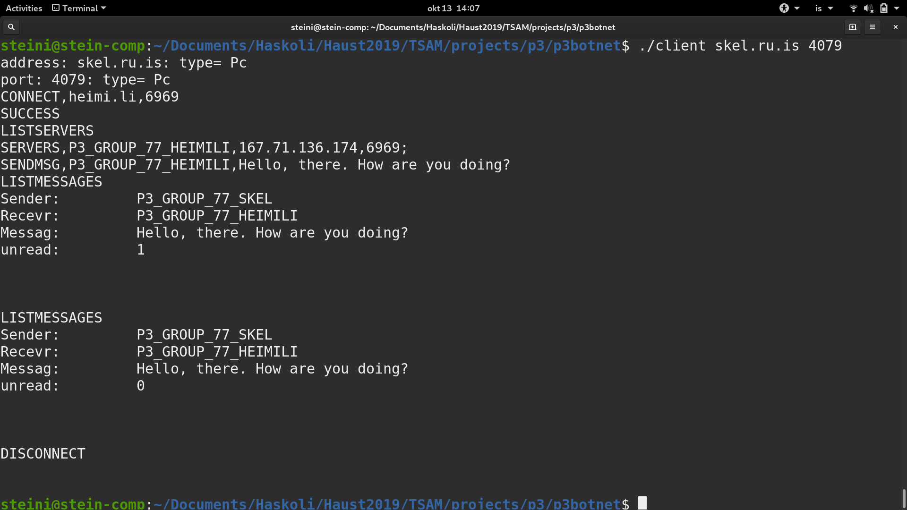
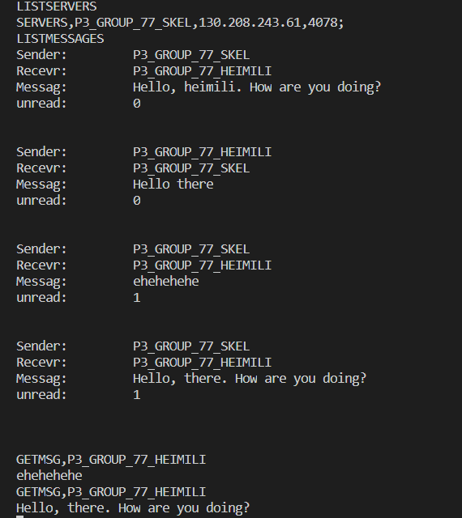

# Project 3 - The botnet rises

## Dependencies

### Boost library
This project uses the boost library for

* String operations
* Circular buffering

To install it on your linux environment do the following

`sudo apt-get update`

`sudo apt-get install libboost-all-dev`

## Environment

The code has been shown to compile on the following systems

### Ubuntu 19.04

| g++ compiler version | 8.3.0                                       |
| -------------------- | ------------------------------------------- |
| **make version**     | **GNU Make 4.2.1**                          |
| **Kernel version**   | **5.0.0-31-generic**                        |
| **OS Type**          | **64-bit**                                  |
| **Processor**        | **Intel® Core™ i5-7200U CPU @ 2.50GHz × 4** |

### **Ubuntu 18.04.3 LTS** - two machines

| **g++ compiler version** | 7.4.0                                          |
| ------------------------ | ---------------------------------------------- |
| **make version**         | **GNU Make 4.1**                               |
| **Kernel version**       | **5.0.0-29-generic** and **4.15.0-65-generic** |
| **OS Type**              | **64 bit**                                     |
| **Processor**            | **Intel® Core™ i5-8300H CPU @ 2.30GHZ**        |


## Compiling with make

### make clean

If at any time other make commands are misbehaving, try using `make clean` and then your intended command

### make all

To make both the server and the client program, use `make` or `make all`

### make server

Makes only the server program

### make client

Makes only the client program

### make compileforskel

Makes both the server and the client program. It uses the `-static-libstdc++` to include the libraries in the executable. The compiled executables can now be moved to `skel.ru.is` via `scp` and then run there

Example:

```bash
make compileforskel
scp tsamgroup77 client thorsteinnk17@skel.ru.is:/home/hir.is/thorsteinnk17/
```

## Running after a successful compilation

### Starting the server

On your command line, do the follwing:

`./tsamgroup77 <your_server_port> CLIENTS <your_clients_port>`

for example

`./tsamgroup77 4077 CLIENTS 4078`

### Client commands overview

`LISTSERVERS`: lists servers who are connected to the server the client is talking to

`GETMSG,<GROUP_ID>`: if a message is in the `message_buffer` with a receiver for this group id, it gets sent to the client

 `SENDMSG,<GROUP_ID>` : a message with the proper sender and receiver is constructed and stored in the `message_buffer`. Now if another server requests this message with `SEND_MSG` it gets sent to that server

`CONNECT,<ADDRESS>,<PORT>`: connects to the supplied address on the supplied port. Reports either `FAIL` or `SUCCESS`

`DISCONNECT`: closes the connection between client and server

### Starting the client and connecting to the server

In this example, we will be connecting to our remote machine and directing it to connect to our skel.ru.is server with the `CONNECT` command. Take note that there are previous messages on the **heimi.li** server

### Client view to skel.ru.is



### Client view to heimi.li

Similar connection methods to above



## Defining your interface when running a server

Find your interface in `ifconfig`

In our example we would go hunting for this

```
   wlp1s0 flags=4163<UP,BROADCAST,RUNNING,MULTICAST>  mtu 1500
   inet 10.3.36.238
```


Inside ip.cpp change the definition to the name of your interface

